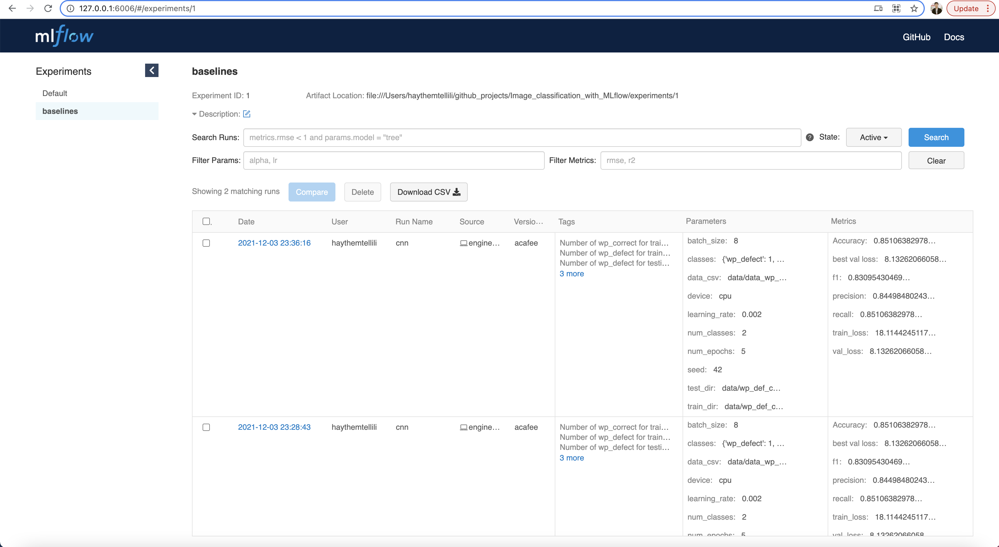

### How to use MLflow to manage the Machine Learning lifecycle.

In this repo, I experiment with MLflow to:

- track machine learning experiments based on:

  - metrics
  - hyper-parameters
  - source scripts executing the run
  - code version
  - notes & comments

- compare different runs between each other
- set up a tracking server.
- train Image classification using Pytroch

### Quickstart locally

To execute the code:

- Install anaconda to run a virtual environment with mlflow (it's cleaner this way)

- Clone the project

```bash
git clone https://github.com/haythemtellili/Image_classification_with_MLflow.git
```

```bash
cd Image_classification_with_MLflow/
```

- create conda environment using environment.yml

```bash
conda env create --file environment.yml
```

- specify the configuration in configs/train_model_config.json

- Launch the training

```bash
python src/engine.py
```
- Start a tracking server locally

```bash
mlflow server --port 6006  --backend-store-uri experiments/
```

- Visit http://localhost:6006 to check the runs on the MLflow ui



